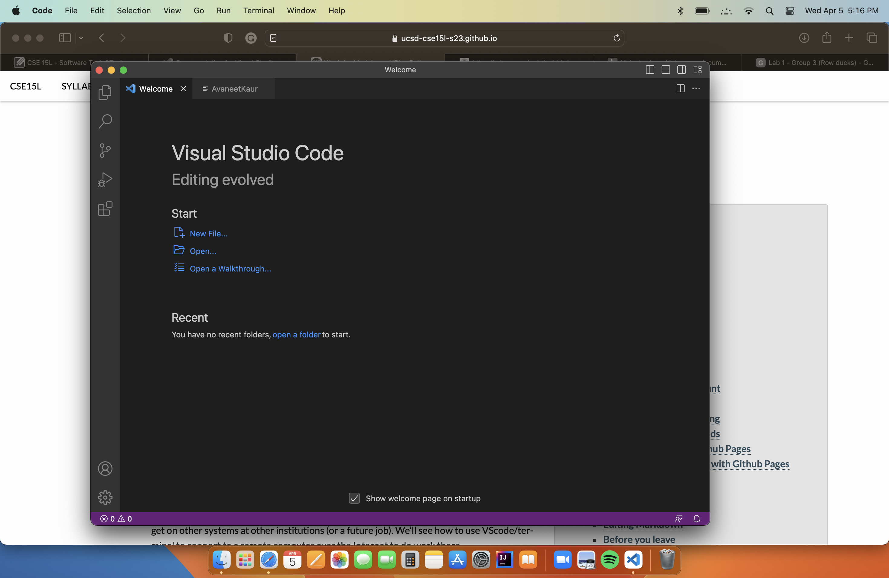
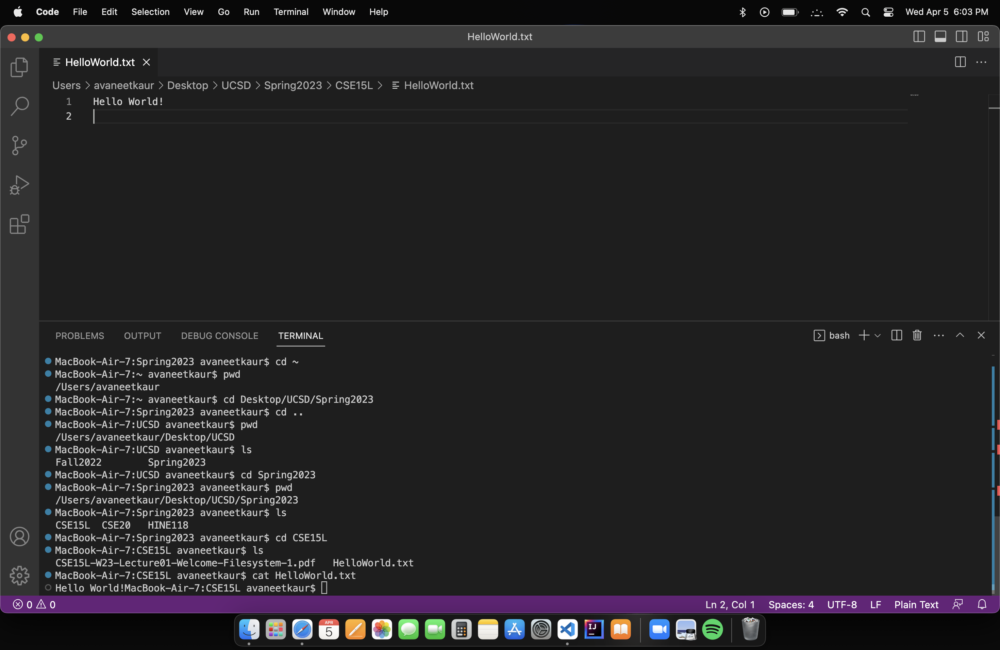

**LAB REPORT 1**

**Installing VScode**

* To install VScode I used the link provided in the week1 lab intructions.
* After opening the VScode website I cliked the download button and selected MACos to install VScode.

**Running Commands**

* I followed the list of commands listed under part 5 of the lab.
* I created two text files in my CSE15l folder to test these commands
* cd ~ changes back to the home directory, cd .. takes back to the parent directory of the working directory. 
* pwd is used to print working directory and ls to list all the items in workign directory.

**Remotely Connecting**

* I typed the ssh command in my terminal to connect to the remote server.
* The first time I used this command, it asked me for permission to connect and I typed yes but I was not able to type my password the cursor just stayed white instead of changing colors from black and white it just stayed white. 
