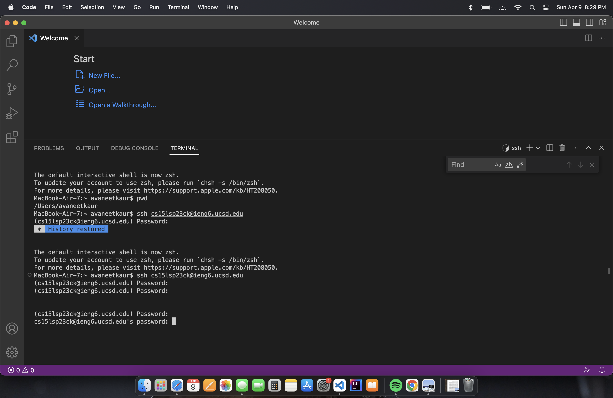

**LAB REPORT 1**

**Installing VScode**
* To install VScode I used the used this [link](https://code.visualstudio.com/).
* After opening the VScode website I cliked the download button and selected MACos to install VScode.

**Running Commands**
* I followed the list of commands listed under part 5 of the lab:
  * `cd` to change directory.
  * `ls` to list contents of current directory.
  * `pwd` to print working directory.
  * `mkdir` to make new directory.
  * `cp` to copy one file to another file.
  * `cat`to print contents of a file.
* I created two text files using `mkdir` in my CSE15l folder to test these commands.

**Remotely Connecting**
* To connect to the remote server I typed `ssh cs15lsp23ck@ieng6.ucsd.edu` in the terminal and entered my password.
* For authentication I typed yes and connected to the remote server.
* I used `pwd` to check if was on the remote server and not on my computer.
