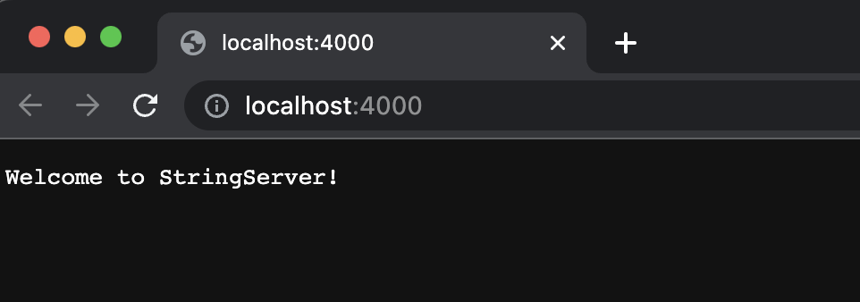
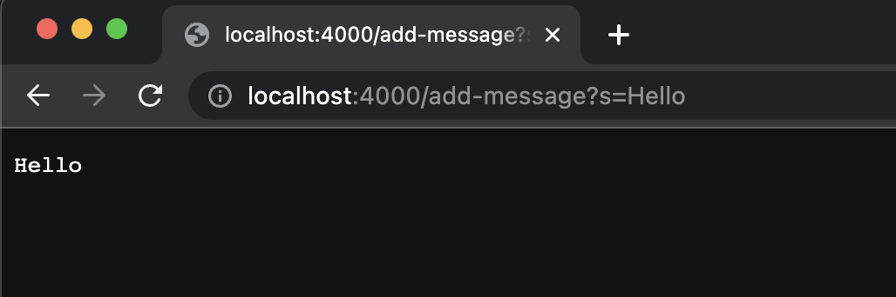
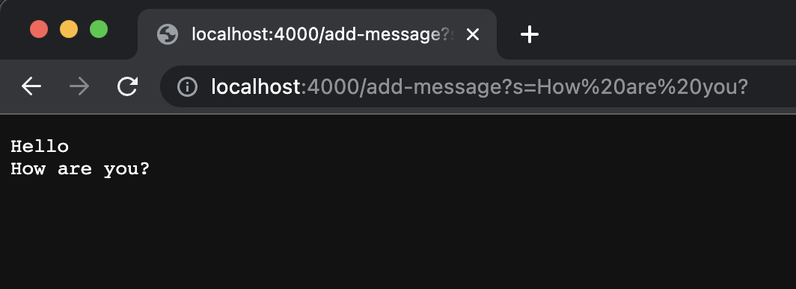
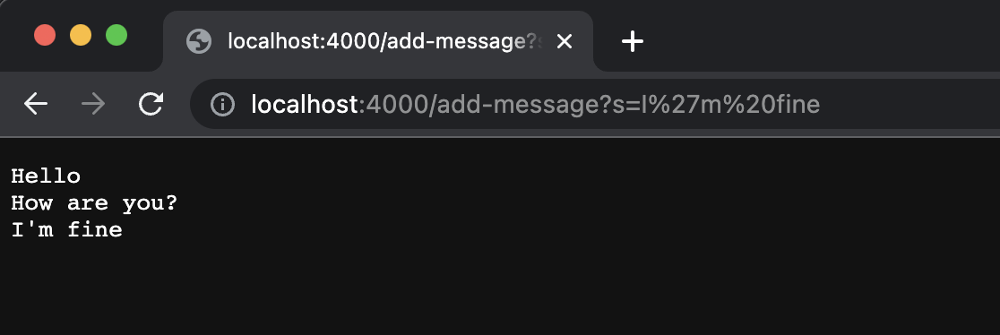
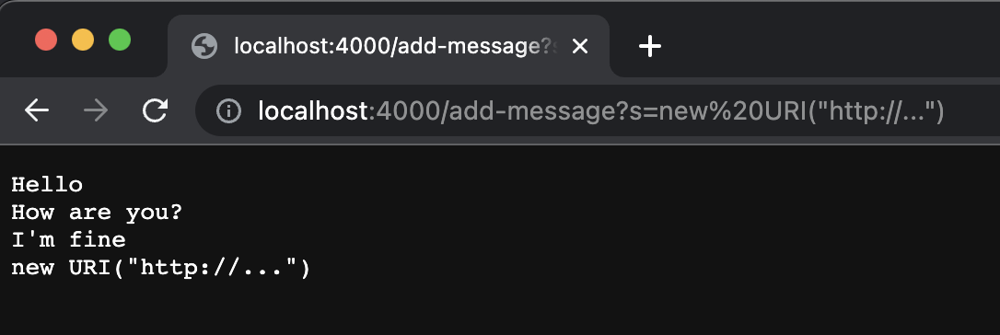
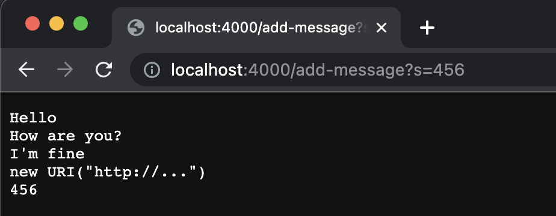
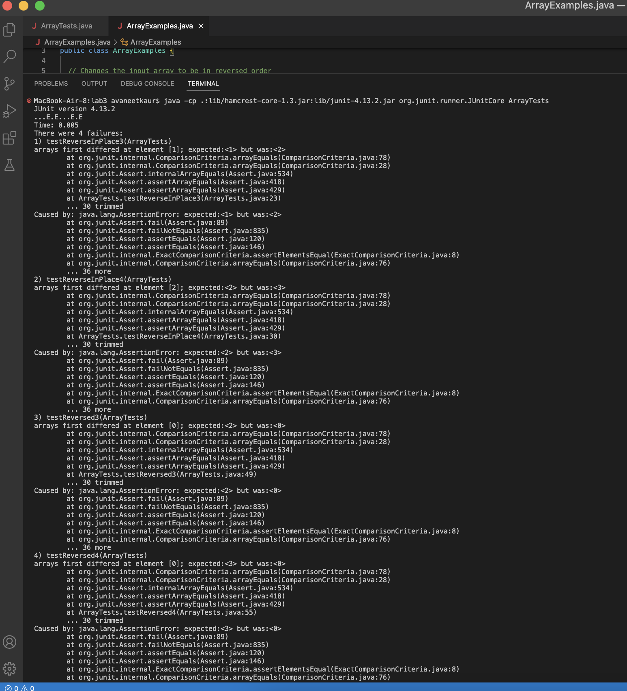

**Part 1**
Building StringServer
```
import java.io.IOException;
import java.net.URI;

class Handler implements URLHandler {
    
    String[] message = {};
    String str = "";

    public String handleRequest(URI url) {
       
        if(url.getPath().equals("/")){
            return "Welcome to StringServer!";
        }
        else if (url.getPath().equals("/add-message")) {
            message = (url.getQuery()).split("s=");
            for(int i = 0; i < message.length; i+=1){
                str = str + message[i];
            }
            str = str + "\n";
            return str;
        } 
        else {
            return "404 Not Found!";
        }
    }
}

class StringServer {
    public static void main(String[] args) throws IOException {
        if(args.length == 0){
            System.out.println("Missing port number! Try any number between 1024 to 49151");
            return;
        }

        int port = Integer.parseInt(args[0]);

        Server.start(port, new Handler());
    }
}
```









**Part 2**

Bug: one of the bugs in lab3 was in ArrayExamples.java class in the reverseInPlace() method.

Failure-Inducing Input
```
@Test
public void testReverseInPlace3 () {
    int [] input1 = {1,2,3};
    ArrayExamples. reverseInPlace (input1) ;
    assertArrayEquals (new int []{3,2,1}, input1);
}
```

Input that doesn't induce failure
```
@Test
public void testReverseInPlace1 () {
    int [] input1 = { 3 };
    ArrayExamples. reverseInPlace (input1); 
    assertArrayEquals (new int[]{ 3 }, input1);
}
```

Symptoms


The Bug: 

Before
```
static void reverseInPlace(int[] arr) {
    for(int i = 0; i < arr.length; i += 1) {
      arr[i] = arr[arr.length - i - 1];
    }
}
 ```
 
After
 ```
static void reverseInPlace (int [] arr) {
    int temp = 0;
    for(int i = 0; i < arr. length / 2; i += 1) {
      temp = arr[i];
      arr[i] = arr[arr. length - 1 - i];
      arr[arr.length - 1 - 1] = temp;
    }
}
```

How does this address the issue?

The method reverseInPlace is supposed to reverse the order of an array, for example `[1,2,3,4]` should become `[4,3,2,1]`. But the original method produced
 `[4,3,3,4]`. This meanes that this method was not keeping track of the original value of the element at index `i`. The modified reverseInPlace method creates a temp variable that stores the original value of `arr[i]` before changing it.
 
 
 **Part 3**
 
Lab 2 was an intoduction to web servers, which was new to me and I still don't understand most of it. I definitely learned more in lab 3. I find the Junit test methods to be very organized when testing code for bugs as it is easier to track. I also learned how to read and interpret output of a buggy code. 


