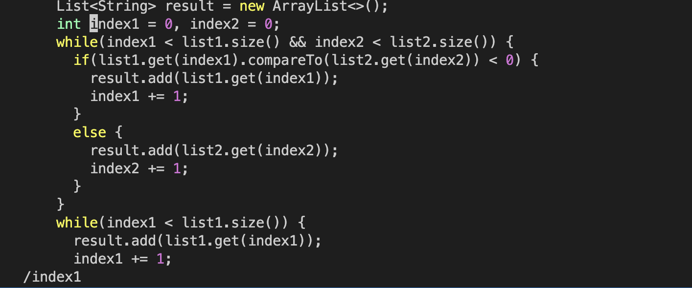

#Lab Report 4

1. Copy the forked repository's url using `ctrl+c`
2. Open terminal in VS code
3. Type `ssh <course-specific-account>` `<enter>` to login to ieng6 account 
4. Type `git clone https://github.com/AvaneetKaur/lab7` `<enter>` to clone the repository to my account 
5. Type `ls` `<enter>` to list all the files and directories in my account
6. Type `cd lab7` `<enter>` to change directory to lab7 repository
7. Type `pwd` `<enter>` to check if directory was changed to lab7
8. Type `ls` `<enter>` to list the contents of lab7 directory 
9. Type `bash test.sh` `<enter>` to run the tests 
10. Type `vim List<tab>` to autocomplete to `vim ListExamples` then type `.j<tab>` to autocomple to `vim ListExamples.java` and press `<enter>`. This   will open the java file in vim.  
11. Type `/` to start the search then type "index1" and press `<enter>`. This will move the cursor to the first occurance of `index 1` after where ever you cursor is. 
12. Press `nnnnnnnnn` to move the cursor to `index1` in the final while loop. 
13. Press `e` to move the cursor at the end of `index1`. 
14. Press `a` to move the cursor once to the right and go into insert mode right away. 
15. Press `<backspace>` to delete the number `1` and type `2`.  
16. Press `<escape>` to go back to normal mode. 
17. Press `:wq` to save the changes and exit vim. 
18. Now your are out of vim. 
19. Type `bash test.sh` to run the tests again. 
20. Type `git add ListExamples.java` to add this java to to be commited
21. Type `git commit -m "index1 changed to index2 in final loop of merge"` to commit the change and write a message explaining the change. 
22. I don't know how to push I tried and it said this 

