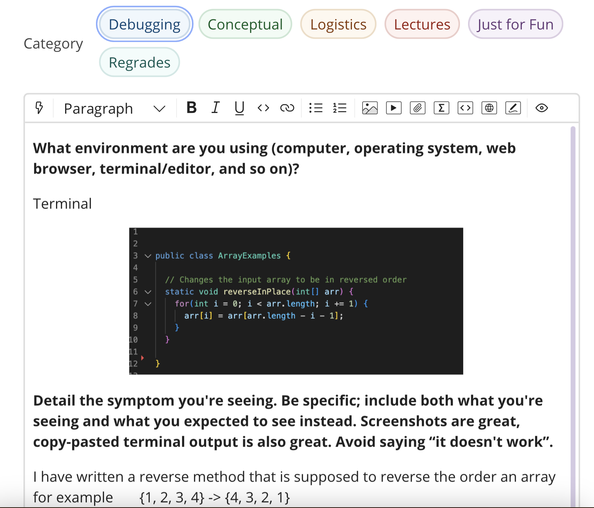
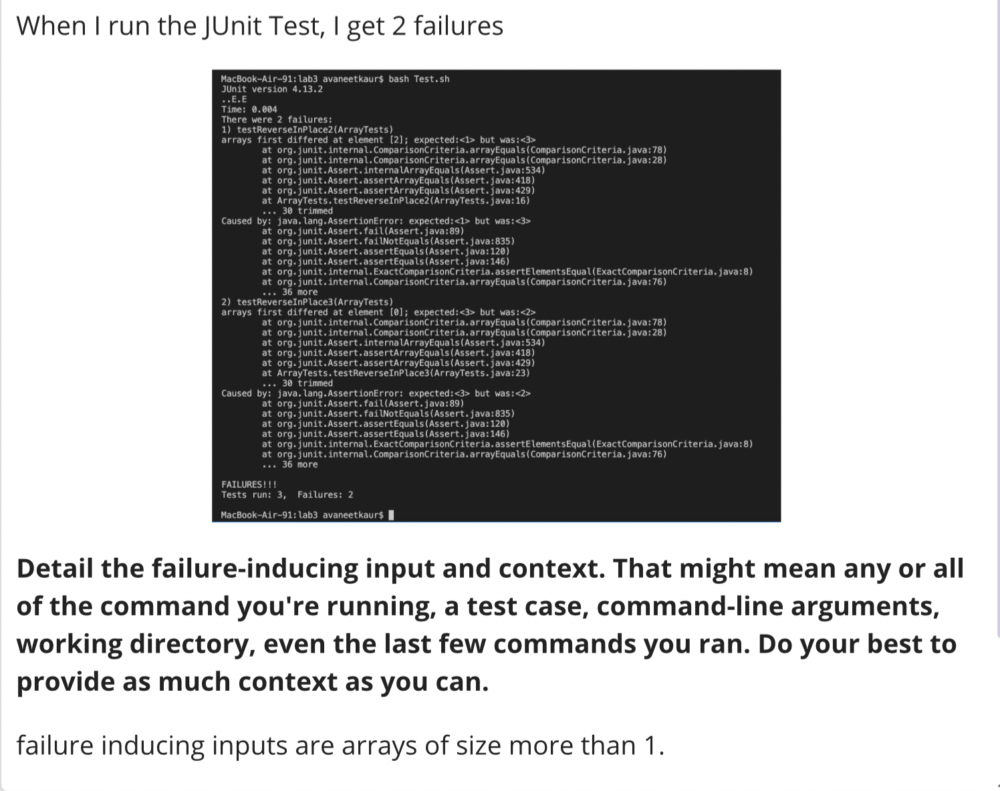
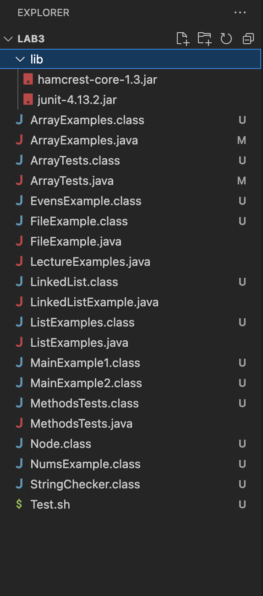
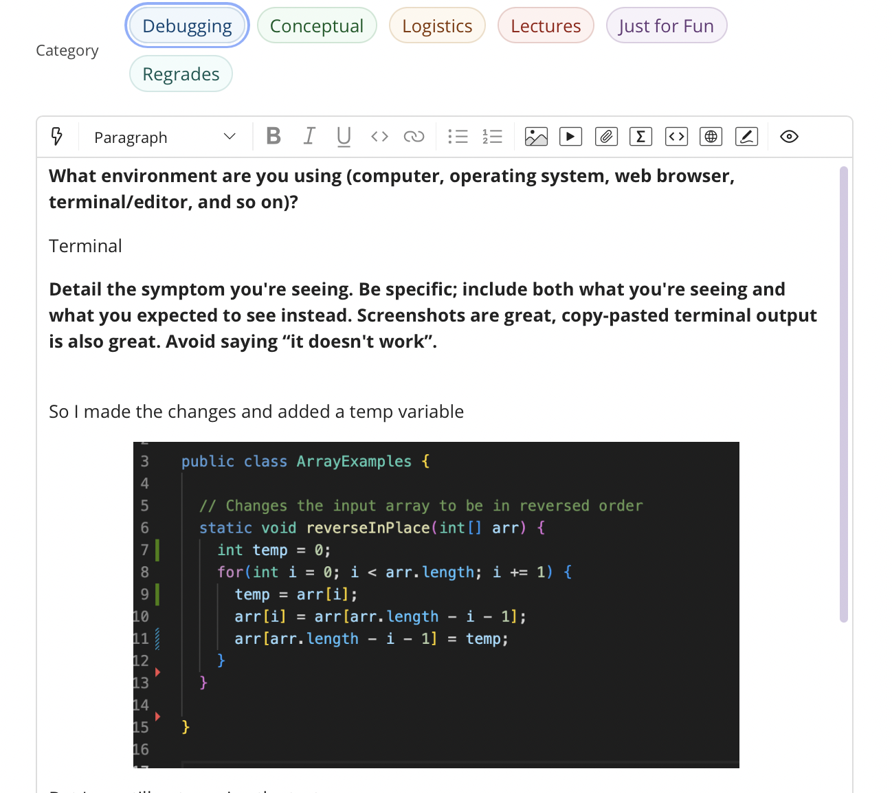
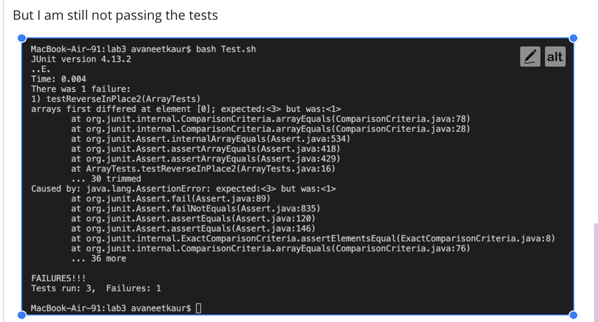
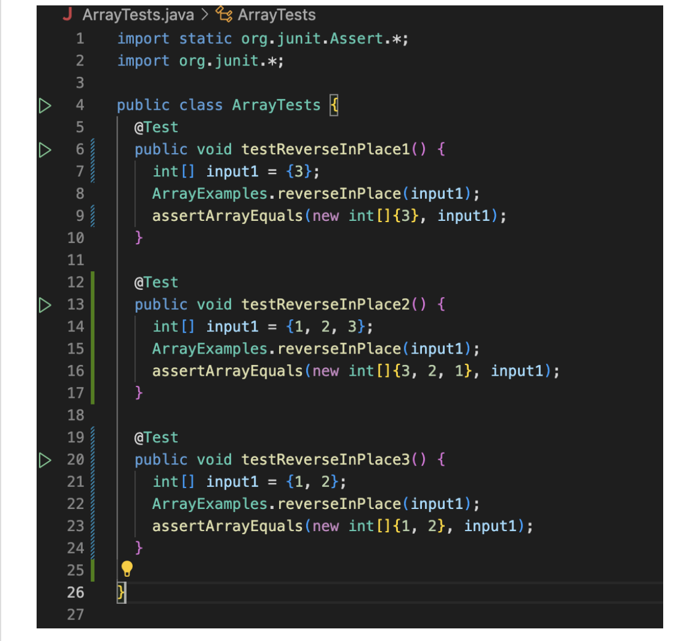
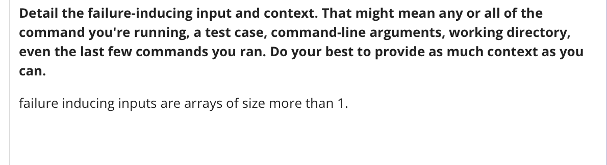
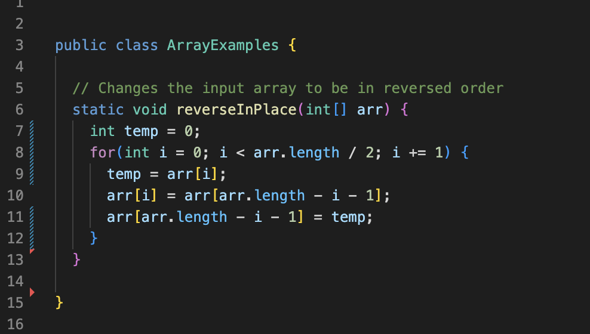
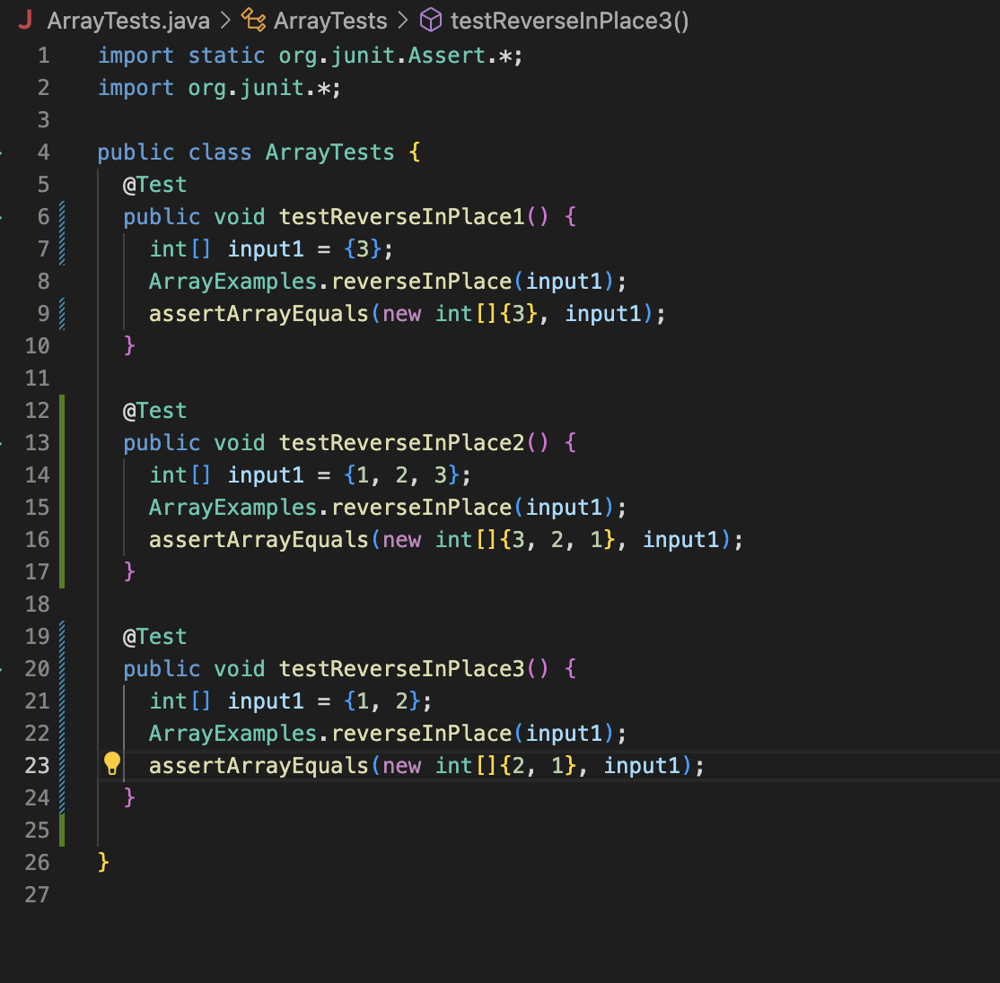
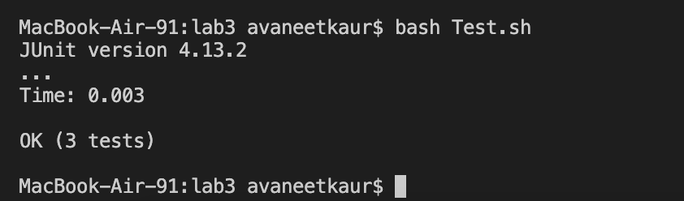

# Lab Report 5
## Part 1: Debugging

1. Edstem Post1   
2. TA's response: When you are changing the values of `arr` in the `reverseInPlace` method you are not keeping track of what the original values are. You need to create another variable which stores the original value of `arr` at index `i` before changing it. 
3. Edstem Post1    
4. TA's response: You are changing values of two indices in the same iteration, so should the for loop still run for `arr.length` many times? Also one of your JUnit tests does not have of correct expected value.
5. Alright, got it.    

## Part2: Reflection

Learning about vim was pretty cool becasue it was the only thing I actually got good at. There were other things like running bash commands from inside the java file but I don't think I can do that on my own. The `.sh` files are also very helful, we don't have to repeat long list of commands when doing something specific we can just create a `.sh` file for it.
