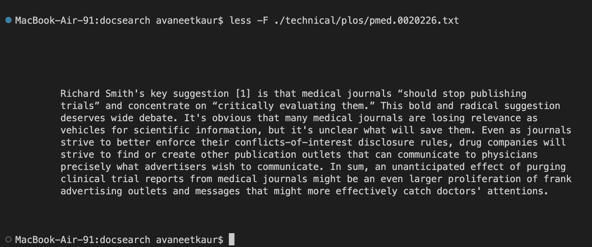
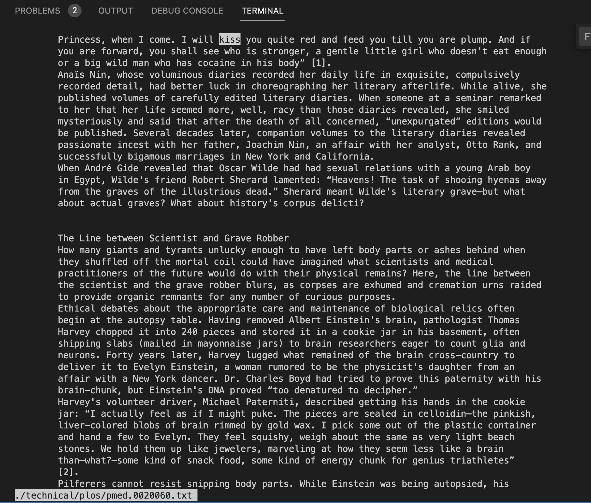

# Researching `less` Command

The `less` command is used to display contents of a file one screen at a time. The general syntax of this command is `less [options] file_path`. 

Some of the few options for using this command are:-
* `-W` highlights first new line after any forward movement. 
* `-N` displays line numbers at the beginning of each line.
* `-F` exit `less` if the entire file can be displayed on the first screen.
* `-p [pattern]` instruct `less` to start at the first occurrence of the specified pattern in the input file.

This information is sourced from [phoenixnap](https://phoenixnap.com/kb/less-command-in-linux).

## Examples
## `less -W`

Example 1

Opens the file

After pressing space to move forward it highlights the first line after the last of the previous window

Example 2

Opens the file

After pressing space to move forward it highlights the first line after the last of the previous window

## `less -N`

Example 1

Opens the file with line numbers added to the begining of each line

Example 2

Opens the file with line numbers added to the begining of each line

## `less -F`

Example 1

Does not open the file instead prints the contents of the file in the terminal

Example 2

Does not open the file instead prints the contents of the file in the terminal

## `less -p`

Example 1

Highlites the string entered with command

Example 2

Highlites the string entered with command 

