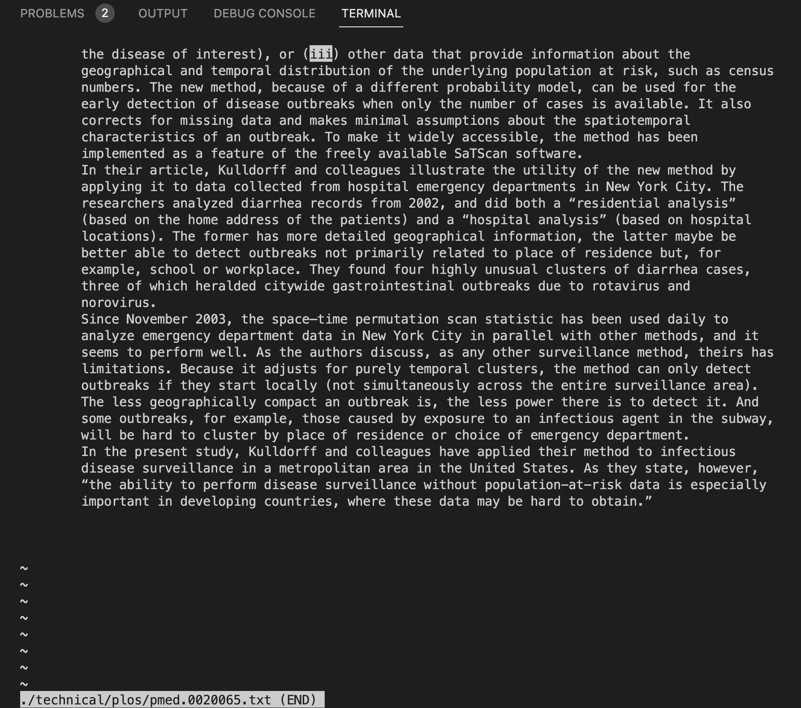

# Researching `less` Command

The `less` command is used to display contents of a file one screen at a time. The general syntax of this command is `less [options] file_path`.

Some of the few options for using this command are:-
* `-W` highlights first new line after any forward movement. 
* `-N` displays line numbers at the beginning of each line.
* `-F` exit less if the entire file can be displayed on the first screen.
* `-p [pattern]` instruct less to start at the first occurrence of the specified pattern in the input file.

This information is sourced from [phoenixnap](https://phoenixnap.com/kb/less-command-in-linux).

## Examples
**`-W`**
Example 1

After pressing space to move forward

Example 2

After pressing space to move forward

**`-N`**
Example 1

Example 2

**`-F`**
Example 1

Example 2

**`-p`**
Example 1

Example 2

